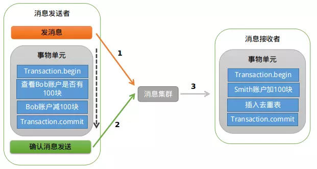

# rocketmq事务消息实现
* [参考一](https://www.jianshu.com/p/453c6e7ff81c)
* [参考二](https://www.jianshu.com/p/6868ddceaa5b)
* [参考三](https://www.jianshu.com/p/c26b3af5880f)
## 分布式事务消息实现思路
>一个简单的案例

Bob向Smith转账，但是两者分处在两个系统中，所以分布式事务中需要拆分事务:
* 事务A，锁定Bob，扣钱，解锁。
* 事务B，锁定Smith.加钱，解锁。

A和B是异步的小事务

>如何实现的思路

这个RMQ已经实现好的方案：
* 发消息和扣款在同一个事务中，消息发送成功而且扣款事务成功才会提交
* 一旦提交到broker，消费者一定会消费到

## RMQ事务消息流程分析

>1.发送prepared消息

A银行系统生成一条转账消息，以事务消息的方式写入RocketMQ，此时B银行系统不可见这条消息

>2.执行本地事务

这个本地的事务可以使用spring的事务管理，执行DB操作，在这里就是扣钱

>3.发送确认消息或者发送回滚命令、修改prepared状态

执行本地事务后，事务成功或者失败需要返回一个状态码给 ``本地事务执行器`` ,如果是成功就会将发送确认命令，反之就会发送回滚命令给MQ，并次改prepared消息状态

>4.查询preapred消息状态和构造新的消息,写入到broker

Broker收到提交/回滚指令后，首先从根据offset从CommitLog读出原有的prepare消息，构造新的消息（修改事务状态标识）并写入Broker。

>5.事务消息回查

如果在步骤3中，发送确认或者回滚命令失败，那么prepared消息可能长期悬挂在MQ中未处理。所以需要定时回查已经发送的prepared消息，将未确认、未回滚的消息重新处理，这里就是事务消息回查机制。但是3.2.6版本之后将这个功能去除了，需要我们自己实现消息回查机制，具体可以往下看。

>6.消费者从broker消费消息

必须指出的是，一旦消息被成功投递到broker，那么只要消费端没有代码异常，那么一会被消费掉。所以严格的说，RMQ的事务消息更加侧重于消息生产方的事务性。至于消费端消费失败，RMQ自带重试机制；至于重复消费，需要消费方自己做幂等。

## RMQ事务消息代码分析

>TransactionMQProducer：事务消息生产者

>TransactionExecuterImpl：本地事务执行器

执行本地事务之后，需要返回一个状态码给本地事务执行器

>TransactionCheckListener：回查监听器

回查监听器回直接跳过已经提交或者回滚的prepared消息，将那些标记的prepared消息处理掉，但是这个功能在3.2.6之后就去除，这个战士的是之前版本的代码。

## RMQ回查机制的实现思路
