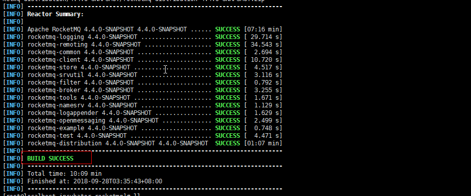
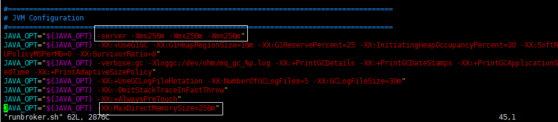
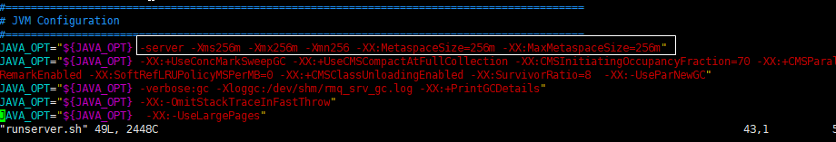
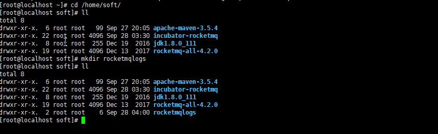
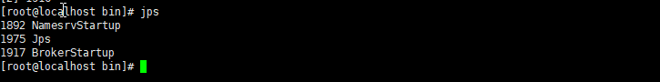
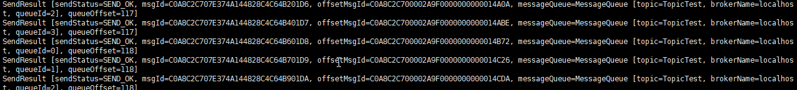
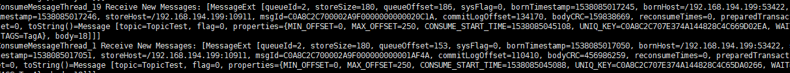

#本文参考点击[这里](https://www.jianshu.com/p/912701cf1705)
# 下载安装rocketmq
## 下载
```
>git clone https://github.com/apache/incubator-rocketmq.git
>cd incubator-rocketmq
>mvn -Prelease-all -DskipTests clean install -U
```
出现以下就是成功：

## 修改JVM参数
>修改runbroker.sh和runserver.sh(incubator-rocketmq/distribution/target/apache-rocketmq/bin目录下)
```
>cd /home/soft/incubator-rocketmq/distribution/target/apache-rocketmq/bin
>vim runbroker.sh
>vim runserver.sh
```


## 建立一个日志目录

## 在bin目录下面配置broker启动模版
>vim broker.p
```
namesrvAddr=127.0.0.1:9876
brokerIP1=192.168.194.199 #这个是虚拟机的ip，你需要将虚拟机设置成静态ip
brokerName=localhost
brokerClusterName=DefaultCluster
brokerId=0
autoCreateTopicEnable=true
autoCreateSubscriptionGroup=true
rejectTransactionMessage=false
fetchNamesrvAddrByAddressServer=false
storePathRootDir=/root/store
storePathCommitLog=/root/store/commitlog
flushIntervalCommitLog=1000
commitIntervalCommitLog=1000
flushCommitLogTimed=false
deleteWhen=04
fileReservedTime=72
maxTransferBytesOnMessageInMemory=262144
maxTransferCountOnMessageInMemory=32
maxTransferBytesOnMessageInDisk=65536
maxTransferCountOnMessageInDisk=8
accessMessageInMemoryMaxRatio=40
messageIndexEnable=true
messageIndexSafe=false
haMasterAddress=
brokerRole=ASYNC_MASTER
flushDiskType=ASYNC_FLUSH
cleanFileForciblyEnable=true
transientStorePoolEnable=false
```
## 启动mq
>分别启动nameserver和broker
```
>nohup sh mqnamesrv >>/home/soft/rocketmqlogs/mqnamesrv.log 2>&1 &
>nohup sh mqbroker -n 192.168.194.199:9876 -c broker.p autoCreateTopicEnable=true >>/home/soft/rocketmqlogs/broker.log 2>&1
```
>使用jps命令查看状态


>测试消息收发，进入bin目录
--  在发送/接收消息之前，我们需要告诉客户名称服务器的位置。RocketMQ 提供了多种方法来实现这一点。为了简单起见，我们使用环境变量NAMESRV_ADDR
```
>export NAMESRV_ADDR=localhost:9876
>sh tools.sh org.apache.rocketmq.example.quickstart.Producer #发
>sh tools.sh org.apache.rocketmq.example.quickstart.Consumer #收
``` 
发：

收：


#使用springboot整合rocketmq
## 关闭防火墙or开放端口9876和10909(一般关闭防火墙就可以啦)
```
>firewall-cmd --zone=public --add-port=8080/tcp --permanent
>firewall-cmd --zone=public --add-port=10909/tcp --permanent
>firewall-cmd --reload
>systemctl stop firewalld.service 
```
## 关闭mq
```
sh mqshutdown broker
sh mqshutdown namesrv
```
## 引入依赖
> 引入的依赖和安装的rocketmq版本直接有着非常大的版本关联关系，由于使用的是4.2.0的rocketmq，所以客户端使用了4.1.0
```
!-- RocketMq客户端相关依赖 -->
        <dependency>
            <groupId>org.apache.rocketmq</groupId>
            <artifactId>rocketmq-client</artifactId>
            <version>4.1.0-incubating</version>
        </dependency>

        <dependency>
            <groupId>org.apache.rocketmq</groupId>
            <artifactId>rocketmq-common</artifactId>
            <version>4.1.0-incubating</version>
        </dependency>
```
## 生产者和消费者
>nameserver/group配置
```
# 消费者的组名
apache.rocketmq.consumer.PushConsumer=PushConsumer

# 生产者的组名
apache.rocketmq.producer.producerGroup=Producer

# NameServer地址
apache.rocketmq.namesrvAddr=192.168.194.199:9876
```
>生产者
```
@Component
public class Producer {

    /**
     * 生产者的组名
     */
    @Value("${apache.rocketmq.producer.producerGroup}")
    private String producerGroup;

    /**
     * NameServer 地址
     */
    @Value("${apache.rocketmq.namesrvAddr}")
    private String namesrvAddr;

    @PostConstruct
    public void defaultMQProducer() {

        //生产者的组名
        DefaultMQProducer producer = new DefaultMQProducer(producerGroup);

        //指定NameServer地址，多个地址以 ; 隔开
        producer.setNamesrvAddr(namesrvAddr);

        try {

            /**
             * Producer对象在使用之前必须要调用start初始化，初始化一次即可
             * 注意：切记不可以在每次发送消息时，都调用start方法
             */
            producer.start();

            for (int i = 0; i < 100; i++) {

                String messageBody = "我是消息内容:" + i;

                String message = new String(messageBody.getBytes(), "utf-8");

                //构建消息
                Message msg = new Message("PushTopic" /* PushTopic */, "push"/* Tag  */, "key_" + i /* Keys */, message.getBytes());

                //发送消息
                SendResult result = producer.send(msg);

                System.out.println("发送响应：MsgId:" + result.getMsgId() + "，发送状态:" + result.getSendStatus());

            }

        } catch (Exception e) {
            e.printStackTrace();
        } finally {
            producer.shutdown();
        }

    }
}
```
>消费者
```
@Component
public class Consumer {

    /**
     * 消费者的组名
     */
    @Value("${apache.rocketmq.consumer.PushConsumer}")
    private String consumerGroup;

    /**
     * NameServer地址
     */
    @Value("${apache.rocketmq.namesrvAddr}")
    private String namesrvAddr;

    @PostConstruct
    public void defaultMQPushConsumer() {

        //消费者的组名
        DefaultMQPushConsumer consumer = new DefaultMQPushConsumer(consumerGroup);

        //指定NameServer地址，多个地址以 ; 隔开
        consumer.setNamesrvAddr(namesrvAddr);
        try {
            //订阅PushTopic下Tag为push的消息
            consumer.subscribe("PushTopic", "push");

            //设置Consumer第一次启动是从队列头部开始消费还是队列尾部开始消费
            //如果非第一次启动，那么按照上次消费的位置继续消费
            consumer.setConsumeFromWhere(ConsumeFromWhere.CONSUME_FROM_FIRST_OFFSET);
            consumer.registerMessageListener(new MessageListenerConcurrently() {

                @Override
                public ConsumeConcurrentlyStatus consumeMessage(List<MessageExt> list, ConsumeConcurrentlyContext context) {
                    try {
                        for (MessageExt messageExt : list) {

                            System.out.println("messageExt: " + messageExt);//输出消息内容

                            String messageBody = new String(messageExt.getBody(), "utf-8");

                            System.out.println("消费响应：Msg: " + messageExt.getMsgId() + ",msgBody: " + messageBody);//输出消息内容

                        }
                    } catch (Exception e) {
                        e.printStackTrace();
                        return ConsumeConcurrentlyStatus.RECONSUME_LATER; //稍后再试
                    }
                    return ConsumeConcurrentlyStatus.CONSUME_SUCCESS; //消费成功
                }


            });
            consumer.start();
        } catch (Exception e) {
            e.printStackTrace();
        }
    }
```
> 测试结果
# 下载安装rocketmq控制台


