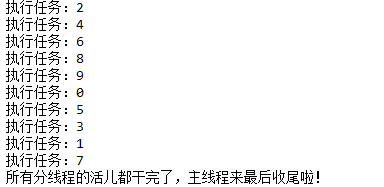

##
```
 @Test
    public void contextLoads() {
        try {
            int num=10;
            CountDownLatch countDownLatch = new CountDownLatch(num);
            //创建一个线程池
            ExecutorService newCachedThreadPool = Executors.newCachedThreadPool();
            //创建10个线程去做不同的事情，每个做外以后都将原子量递减一次
            for (int i = 0; i <num ; i++) {
                newCachedThreadPool.execute(new TestRunale(i,countDownLatch));
            }
            //countDownLatch原子量直到为0前一直等待分线程结果
            countDownLatch.await();
        } catch (InterruptedException e) {
            e.printStackTrace();
        }
        System.out.println("所有分线程的活儿都干完了，主线程来最后收尾啦！");


    }

    class TestRunale implements Runnable {
        int i;
        CountDownLatch doneSignal;

        public TestRunale(int i,CountDownLatch doneSignal) {
            this.i = i;
            this.doneSignal=doneSignal;
        }

        @Override
        public void run() {
            System.out.println("执行任务：" + i);
            //每个线程执行完毕后再见原子量递减
            doneSignal.countDown();
        }
    }
```
执行结果：
