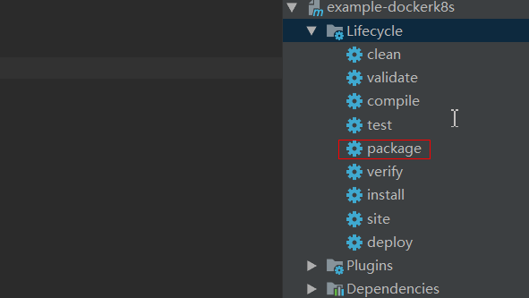
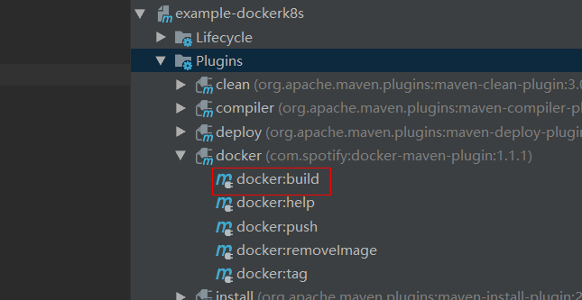
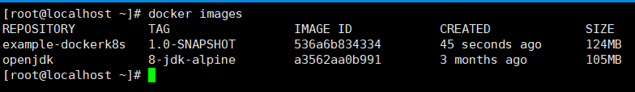
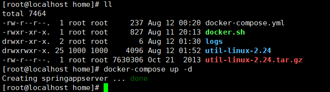
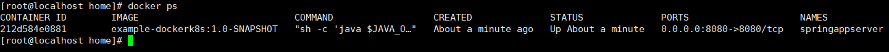
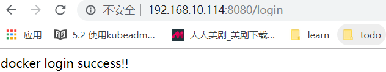
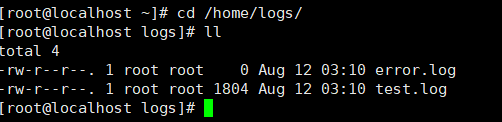

# 环境
> 安装docker、docker-compose的宿主机，开启docker远程访问，开放远程访问端口

# 构建一个SpringDemo
## Controller
```java
@RestController
public class UserController {

  @GetMapping("/login")
  public String login() {
    return "docker login success!!";
  }

}
```
## Main
```java
@SpringBootApplication
public class DockerApplication {

  public static void main(String[] args) {
    SpringApplication.run(DockerApplication.class, args);
  }
}

```
## log4j2日志配置
```xml
<?xml version="1.0" encoding="UTF-8"?>
<configuration monitorInterval="30" status="info">
    <!--定义appender-->
    <appenders>
        <!--输出控制台-->
        <Console follow="true" name="Console" target="SYSTEM_OUT">
            <PatternLayout pattern="%d{HH:mm:ss.SSS} %-5level %class{36} %L %M - %msg%xEx%n"/>
        </Console>

        <!--append=false每次运行程序会自动清空，适合临时测试用-->
        <RollingFile append="false" fileName="/home/logs/test.log"
                     filePattern="/home/logs/reduceinfo/$${date:yyyy-MM}/info-%d{yyyy-MM-dd}-%i.log"
                     name="RollingFileInfo">
            <Filters>
                <!--控制台只输出level及以上级别的信息（onMatch），其他的直接拒绝（onMismatch）-->
                <ThresholdFilter level="INFO" onMatch="ACCEPT" onMismatch="DENY"/>
                <ThresholdFilter level="WARN" onMatch="DENY" onMismatch="NEUTRAL"/>
            </Filters>
            <PatternLayout pattern="[%d{HH:mm:ss:SSS}] [%p] - %l - %m%n"/>
            <Policies>
                <SizeBasedTriggeringPolicy size="100 MB"/>
                <TimeBasedTriggeringPolicy/>
            </Policies>
        </RollingFile>
        <!-- 指定存储ERROR以上的日志，每次大小超过size会自动存入按年份-月份建立的文件夹下面并进行压缩-->
        <RollingFile fileName="/home/logs/error.log"
                     filePattern="/home/logs/reduceerror/$${date:yyyy-MM}/warn-%d{yyyy-MM-dd}-%i.log"
                     name="RollingFileError">
            <DefaultRolloverStrategy max="20"/>
            <Filters>
                <ThresholdFilter level="WARN" onMatch="ACCEPT" onMismatch="DENY"/>
                <ThresholdFilter level="ERROR" onMatch="ACCEPT" onMismatch="DENY"/>
            </Filters>
            <PatternLayout pattern="[%d{HH:mm:ss:SSS}] [%p] - %l - %m%n"/>
            <!-- DefaultRolloverStrategy属性如不设置，则默认为最多同一文件夹下7个文件，这里设置了20 -->
            <Policies>
                <SizeBasedTriggeringPolicy size="100 MB"/>
                <TimeBasedTriggeringPolicy/>
            </Policies>
        </RollingFile>

    </appenders>
    <!--定义logger-->
    <loggers>
        <!--过滤掉spring和hibernate级别在WARN下的信息-->
        <logger level="WARN" name="org.springframework">
        </logger>
        <logger level="WARN" name="org.mybatis">
        </logger>
        <root level="DEBUG">
            <appender-ref ref="Console"/>
            <appender-ref ref="RollingFileInfo"/>
            <appender-ref ref="RollingFileError"/>
        </root>
    </loggers>

</configuration>
```
## application.yml
```yaml
server:
  port: 8080
```

## 添加docker-maven插件依赖
```
<plugin>
        <groupId>com.spotify</groupId>
        <artifactId>docker-maven-plugin</artifactId>
        <version>1.1.1</version>
        <configuration>
          <!--镜像名称-->
          <imageName>${project.artifactId}:${project.version}</imageName>
          <!--安装了docker的主机，并且打开了api remote接口设置-->
          <dockerHost>http://192.168.10.114:2375</dockerHost>
          <!--指定 Dockerfile 的位置-->
          <dockerDirectory>${project.basedir}</dockerDirectory>
          <resources>
            <resource>
              <!--jar包位置-->
              <targetPath>/</targetPath>
              <directory>${project.build.directory}</directory>
              <!--默认是${project.artifactId}-${project.version}-->
              <include>${project.build.finalName}.jar</include>
            </resource>
          </resources>
        </configuration>
      </plugin>
```

# 编写DokerFile

- Spingboot项目的日志保存在/home/logs下，docker容器启动后需要将容器内的日志挂载出来，方便在宿主机查看容器内日志。
- $JAVA_OPTS是在docker-compose.yml中指定的环境变量，变量值就是JVM优化后的参数；目的就是在容器启动后优化JVM。
- SpringBoot项目的访问端口是8080，容器启动后需要将该端口映射出来。
- 容器启动后需要指定时区，防止容器内时区不在东八区，这一点非常重要。

```
FROM openjdk:8-jdk-alpine
VOLUME /home/logs
RUN mkdir -p /home/logs
RUN ln -sf /usr/share/zoneinfo/Asia/Shanghai /etc/localtime
RUN echo 'Asia/Shanghai' >/etc/timezone
COPY *.jar /app.jar
EXPOSE 8080
ENTRYPOINT ["sh","-c","java $JAVA_OPTS -Djava.security.egd=file:/dev/./urandom  -Duser.timezone=GMT+08 -jar /app.jar"]
``` 
# 编写docker-compose.yml
- images：镜像名，当然你可也可以根据dockerfile来构建，我这里使用maven插件已经将工程打包成镜像，所以就用打包好的镜像咯
- environment：着这里指定JAVA_OPTS环境变量，值就是JVM参数
- volumes：将容器内的logs目录挂载到宿主机的logs目录

```yaml
version: '3'
services:
  springappserver:
    container_name: springappserver
    images: example-dockerk8s:1.0-SNAPSHOT
    ports:
      - "8080:8080"
    volumes:
      - "/home/logs:/home/logs"
    environment:
      - JAVA_OPTS=-Xmx256m -Xms256m

```

# 打包镜像上传到宿主机
## 打包项目



## 制作镜像并上传到宿主机

> 1.使用docker插件制作镜像并上传宿主机



> 2.宿主机查看上传的镜像



# 启动容器

 >将docker-compose.yml上传到宿主机/home
 >使用`docker-compose up --d`启动容器
 >使用`docker ps`查看启动的容器

 

 

# 访问项目

 

# 宿主机查看容器内日志
