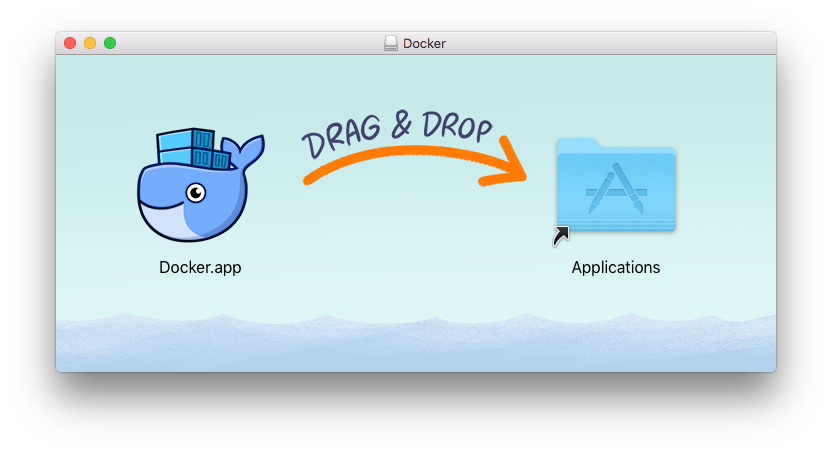

# 安装docker

## 在mac 上安装docker
参考：https://docs.docker.com/docker-for-mac/install/

* 下载docker安装文件：[稳定版](https://download.docker.com/mac/stable/Docker.dmg),[最新版](https://download.docker.com/mac/edge/Docker.dmg)
* 安装运行docker  

* 申请自己的docker id，登陆；

## 在windows上安装docker
参考： https://docs.docker.com/docker-for-windows/install/

## 在centos 上安装docker

* 新建安装脚本``vim docker.sh``   ``chmod +x install.sh``

```shell
# bin/bash
rm -rf /usr/local/bin/docker-compose
sudo yum remove -y docker \
                  docker-client \
                  docker-client-latest \
                  docker-common \
                  docker-latest \
                  docker-latest-logrotate \
                  docker-logrotate \
                  docker-selinux \
                  docker-engine-selinux \
                  docker-engine

sudo yum install -y yum-utils \
  device-mapper-persistent-data \
  lvm2

sudo yum-config-manager --add-repo http://mirrors.aliyun.com/docker-ce/linux/centos/docker-ce.repo
sudo yum install -y docker-ce.x86_64 0:18.03.1.ce-1.el7.centos

curl -L https://get.daocloud.io/docker/compose/releases/download/1.21.2/docker-compose-`uname -s`-`uname -m` > /usr/local/bin/docker-compose
chmod +x /usr/local/bin/docker-compose
```

## docker 加速

* 由于国内网络原因，DOCKER访问docker hub经常超时，为了能够给DOCKER加速，我们可使用国内DOCKER镜像：``vim /etc/docker/daemon.json ``

```json
{
"registry-mirrors": [ "https://registry.docker-cn.com"]
}
```

* 重启docker 

```
systemctl daemon-reload 
systemctl restart docker
```

```
#!/bin/bash
#install docker in ubuntu and centos


function install_docker_in_ubuntu
{
    sudo  apt-get update -y
    # install some tools
    sudo apt-get install \
        apt-transport-https \
        ca-certificates \
        curl \
        gnupg-agent \
        software-properties-common \
        net-tools \
        wget -y

    # install docker
    curl -fsSL get.docker.com -o get-docker.sh
    sh get-docker.sh

    # start docker service
    sudo groupadd docker &> /dev/null
    sudo gpasswd -a "${USER}" docker
    sudo systemctl start docker

    rm -rf get-docker.sh
}


function install_docker_in_centos
{
    # install some tools
    sudo yum install -y git vim gcc glibc-static telnet bridge-utils

    # install docker
    curl -fsSL get.docker.com -o get-docker.sh
    sh get-docker.sh

    # start docker service
    sudo groupadd docker &> /dev/null
    sudo gpasswd -a "${USER}" docker
    sudo systemctl start docker

    rm -rf get-docker.sh

}


SYSTEM_NAME="$(awk -F= '/^NAME/{print $2}' /etc/os-release)"
if [[ "${SYSTEM_NAME,,}" =~ "ubuntu"  ]] ; then
    echo "Your system is ubuntu."
    echo "Installing Docker in ubuntu..."
    install_docker_in_ubuntu
elif [[ "${SYSTEM_NAME,,}" =~ "centos" ]] ; then
    echo "Your system is centos."
    echo "Installing Docker in centos..."
    install_docker_in_centos
else
    echo "This script can only run in ubuntu and centos system."
    exit 1
fi
```
