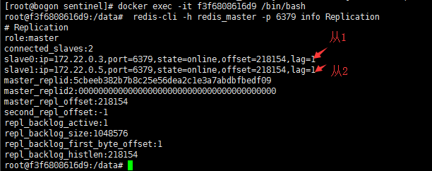

# 前言：这里我们开始使用docker搭建redis的sentinel模式，使用scale扩容
* [参考文章](https://blog.csdn.net/boling_cavalry/article/details/78995407),本文修改部分内容，减少采坑
# 1.新建一个sentinel文件夹，包含以下文件

## 1.1编写一个Dockerfile,用于生成sentinel镜像
```
FROM redis:4
EXPOSE 16379
#替换原有的sentinel.conf文件,默认在etc/redis/中
ADD sentinel.conf /etc/redis/sentinel.conf
RUN chown redis:redis /etc/redis/sentinel.conf
ADD sentinel-entrypoint.sh /usr/local/bin/
RUN chmod +x /usr/local/bin/sentinel-entrypoint.sh
#定义启动容器时自动执行的脚本
ENTRYPOINT ["sentinel-entrypoint.sh"]
```
## 1.2自定义sentinel.conf
```
port 26379

protected-mode no

dir "/tmp"

sentinel monitor mymaster redis-master 6379 $SENTINEL_QUORUM

sentinel down-after-milliseconds mymaster $SENTINEL_DOWN_AFTER

sentinel parallel-syncs mymaster 1

sentinel failover-timeout mymaster $SENTINEL_FAILOVER
```
## 1.2编写脚本，定义sentinel容器启动后监控的master和其他参数
```
#!/bin/sh
# 替换原有参数
sed -i "s/\$SENTINEL_QUORUM/$SENTINEL_QUORUM/g" /etc/redis/sentinel.conf
ed -i "s/\$SENTINEL_DOWN_AFTER/$SENTINEL_DOWN_AFTER/g" /etc/redis/sentinel.conf
sed -i "s/\$SENTINEL_FAILOVER/$SENTINEL_FAILOVER/g" /etc/redis/sentinel.conf
#再执行另一个脚本
exec docker-entrypoint.sh redis-server /etc/redis/sentinel.conf --sentinels
```
## 1.3生成镜像
```
docker build -t redis-sentinel:4.0 .
```
# 2.编写docker-compose启动容器

## 2.1docker-compose.yml
```
version: '3'
services:
  redis_master:
    image: redis:4
    ports:
     - "6379:6379"
  redis_slave:
    image: redis:4
    # ports: # 如果使用scale扩容，就不能指定端口映射，扩容时候会出现端口占用
    #  - "6479:6379"
    command: redis-server --slaveof redis-master 6379
    links: 
     - redis_master:redis-master
  sentinel:
    image: redis-sentinel:4.0
    environment:
     - ENV SENTINEL_QUORUM 2
     - ENV SENTINEL_DOWN_AFTER 30000
     - ENV SENTINEL_FAILOVER 180000
    links:
     - redis_master:redis-master
     - redis_slave1
    # ports:
    #  - "26379:26379"
```
## 启动容器,然后使用RedisDesktopManager软件连接redis_master，可以看见redis信息
```
docker-compose up -d
```

# 3.弹性扩展
之前的步骤已经搭建好了一主一从一哨兵，我们需要搭建1主2从三哨兵。有以下两种方式：
* 可以修改docker-compose.yml，在yml文件里指定构建1主2从三哨兵，这种方式较位自由，可以指定每个主从和每个哨兵的端口映射
* 可以使用scale弹性扩展，速度快，但是扩展时要讲yml中被扩展服务的端口映射注释掉，不然会端口占用异常
## 3.1docker弹性扩展
### 扩展slave为两个，sentinel为三个
```
docker-compose scale redis_slave=2 #两个从
docker-compose scale sentinel=3 #三个哨兵
```

### 扩容以后，查看主从信息是否生效
```
docker exec -it 4b88664fca3a  /bin/bash #进入sentinel1容器
redis-cli -h redis_master -p 6379 info Replication #查看主节点信息
```

