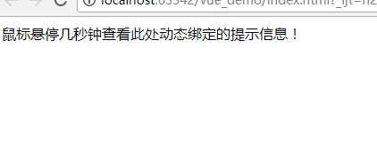

# 绑定 DOM 元素属性

## 代码
```
<!DOCTYPE html>
<html lang="en">
<head>
    <meta charset="UTF-8">
    <title>Title</title>
    <script src="https://unpkg.com/vue"></script>
</head>
<body>
<div id="app-2">
  <span v-bind:title="message">
    鼠标悬停几秒钟查看此处动态绑定的提示信息！
  </span>
</div>
<script>
    var app2 = new Vue({
        el: '#app-2',
        data: {
            message: '页面加载于 ' + new Date().toLocaleString()
        }
    })
</script>
</body>
</html>
```

## 效果



## 说明

这里我们遇到点新东西。你看到的 v-bind 属性被称为指令。指令带有前缀 v-，以表示它们是 Vue 提供的特殊属性。可能你已经猜到了，它们会在渲染的 DOM 上应用特殊的响应式行为。简言之，这里该指令的作用是：“将这个元素节点的 title 属性和 Vue 实例的 message 属性保持一致”。
再次打开浏览器的 JavaScript 控制台输入 ``app2.message = '新消息'``，就会再一次看到这个绑定了 title 属性的 HTML 已经进行了更新。

