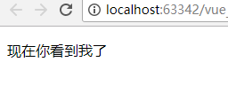

# v_if

## 代码

```
<!DOCTYPE html>
<html lang="en">
<head>
    <meta charset="UTF-8">
    <title>Title</title>
    <script src="https://unpkg.com/vue"></script>
</head>
<body>
<div id="app-3">
    <p v-if="seen">现在你看到我了</p>
</div>
<script>
    var app3 = new Vue({
        el: '#app-3',
        data: {
            seen: true
        }
    })
</script>
</body>
</html>
```

## 效果



## 说明

继续在控制台设置 app3.seen = false，你会发现“现在你看到我了”消失了。
继续在控制台设置 app3.seen = false，你会发现“现在你看到我了”消失了。
这个例子演示了我们不仅可以绑定 DOM 文本到数据，也可以绑定 DOM 结构到数据。而且，Vue 也提供一个强大的过渡效果系统，可以在 Vue 插入/更新/删除元素时自动应用过渡效果。
